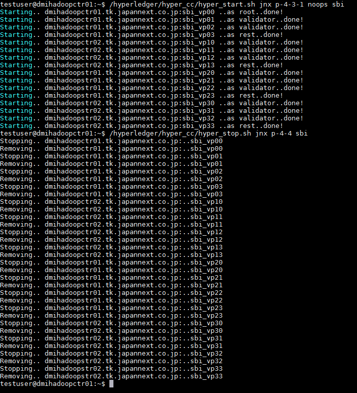

# Hyperledger node control center (hyper_cc) + Test scripts

The scripts were created to take control of hyperledger nodes.

## Requirements
 - Dedicated nodes, VMs or physical servers are fine.
 - Installed docker on each node.
 - SSH, with key installed.

## How it works
The script will generate a docker command then send it through ssh connection for each server. The node will initial hyperledger under a docker environment with predefined parameters as following:
- CORE_PEER_ADDRESSAUTODETECT=true
- CORE_PEER_SYNC_BLOCKS_CHANNELSIZE=100
- CORE_PEER_SYNC_STATE_SNAPSHOT_CHANNELSIZE=500
- CORE_PEER_SYNC_STATE_DELTAS_CHANNELSIZE=200
- CORE_PEER_VALIDATOR_CONSENSUS_PLUGIN=pbft
- CORE_PEER_VALIDATOR_CONSENSUS_BUFFERSIZE=7500
- CORE_PEER_VALIDATOR_CONSENSUS_EVENTS_BUFFERSIZE=1000
- CORE_PBFT_GENERAL_N=4
- CORE_PBFT_GENERAL_K=2
- CORE_PBFT_GENERAL_TIMEOUT_REQUEST=10s
- CORE_PBFT_GENERAL_MODE=classic
- CORE_SECURITY_ENABLED=false
  
## Diagram
coming soon

## Usage

##### Nodes up
To start 4 nodes with sbi as its prefix.<br />
Cmd: hyper_start.sh total_number node_prefix
```sh
$ hyper_start.sh 4 sbi 
```
##### Nodes up (one specific node)
To start only the 2nd node.<br />
Cmd: hyper_start.sh -specific_node_index node_prefix
```sh
$ hyper_start.sh -2 sbi
```

##### Nodes down
To stop all 6 nodes.<br />
Cmd: hyper_stop.sh total_number node_prefix
```sh
$ hyper_stop.sh 6 sbi
```

##### Nodes down (one specific node)
To stop only the 3rd node.<br />
Cmd: hyper_stop.sh -specific_node_index node_prefix
```sh
$ hyper_stop.sh -3 sbi
```

##### Clean up Hyperledger database
Cmd: clean_db.sh
```sh
$ clean_db.sh
```

# Hyperledger test script
We also create the test scripts that included deploy, invoke, and basic system stats (CPU,Memory,Disk,Network)

## Usage
### Deploy a chaincode
Cmd: test_script/deploy.sh [acc|opt account_hash]

Deploying account chaincode
```sh
$ test_script/deploy.sh 
```

Deploying option chaincode
```sh
$ test_script/deploy.sh opt hash
```

### Account creation
To create number of accounts.<br />
Cmd: test_script/acc_rest.sh account_prefix total_account account_chainhash_result [fps]<br />
E.g. Creating 1000 TestAcc prefixed accounts with speed 10 fps.
```sh
$ test_script/acc_rest.sh TestAcc 1000 hash 10
```

### Invoke transactions
To invoke number of transactions to a specified account.<br />
Cmd: test_script/invoke_rest.sh acc_name total_transac chainhash [fps]<br />
E.g. Invoking 1,000,000 times to an account A_1, with speed 80 fps.
```sh
$ test_script/.sh A_1 1000000 hash 80
```


### System status
To view the current system status of the logged in node.<br />
Cmd: test_script/check_util.sh node_name count docker|real [sleep_time]<br />
E.g. Viewing the status of the node running with docker, named sbi_vp0, with 1000 loops, and 2 mins per loop.
```sh
$ test_script/check_util.sh sbi_vp0 1000 docker 120
```
E.g. Viewing the status of the physical node, named sbi_vp5, with 500 loops, and 50 seconds per loop.
```sh
$ test_script/check_util.sh sbi_vp5 500 real 50
```
